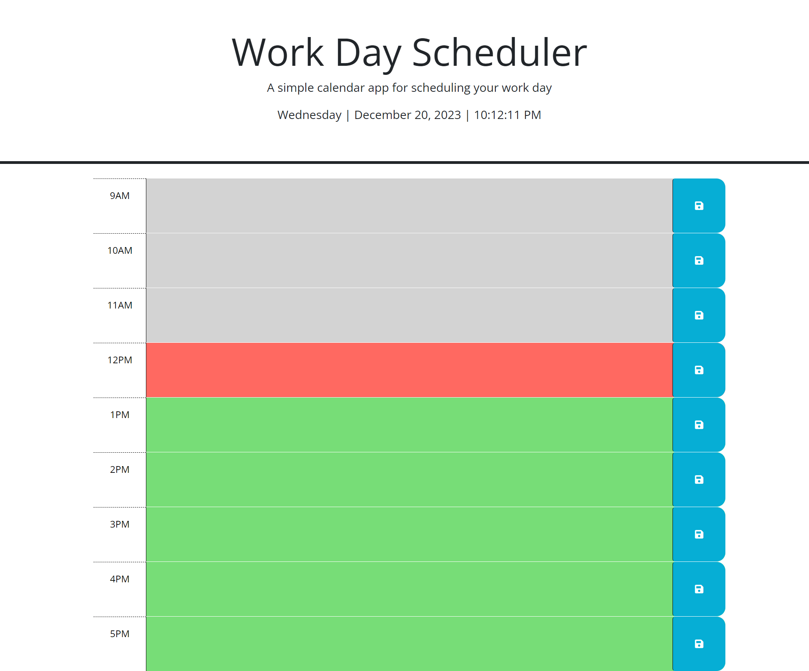
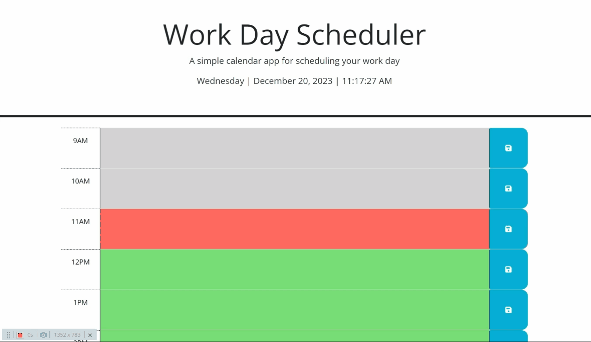
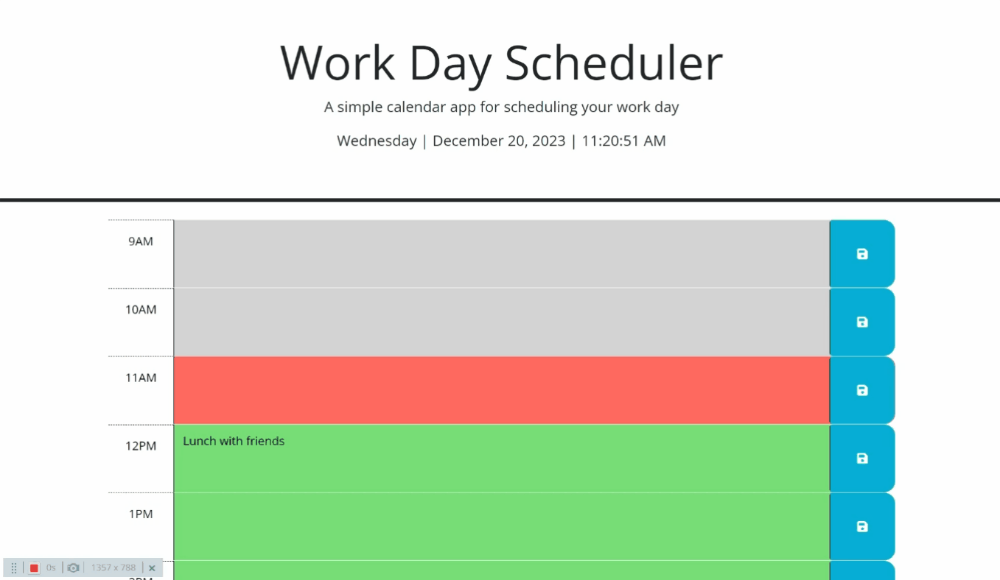

# Work Day Scheduler

## Description

This project is a simple calendar application that enables users to schedule events for each hour of a typical working day (9 am – 5 pm). The application runs in the browser and utilizes dynamically updated HTML and CSS powered by jQuery. The Day.js library is employed for efficient handling of date and time functionalities.

The motivation behind creating this project is to provide users with an easy-to-use daily planner, allowing them to manage and organize their time effectively.

### Learning

- **Day.js Library:** Learn and apply the Day.js library for efficient date and time handling.
- **Responsive Design:** Practice creating a responsive and visually appealing interface.

## Installation

To install and run this project locally, follow these steps:

1. Clone the repository to your local machine.
    
    git clone git@github.com:jodielee062788/challenge-work-day-scheduler.git

2. Open the project folder in your code editor.
3. Explore the code and open index.html in your web browser.

## Usage

1. Upon opening the planner, the current day is displayed at the top of the calendar.

    

2. Scroll down to view timeblocks for standard business hours (9 am – 5 pm). Each timeblock is color-coded to indicate whether it is in the past, present, or future.

    

3. Click into a timeblock to enter an event.

    

4. Save the entered event by clicking the save button for that timeblock.

    

5. Refresh the page; saved events persist. New events can be saved by entering a new  event and clicking the save button.

    

## Live Demo

Check out the live demo of the Password Generator [here](https://jodielee062788.github.io/challenge-work-day-scheduler/).

## Credits

- This project was modified and improved by Jodie Lee 
- USYD Bootcamp
- [Bootstrap](https://getbootstrap.com/)
- [Font Awesome](https://fontawesome.com/)
- [Day.js](https://day.js.org/)
- [jQuery](https://jquery.com/)

## How to Contribute

If you'd like to contribute to this project, please follow these guidelines:

1. Fork the project.
2. Create a new branch for your feature or bug fix.
3. Commit your changes.
4. Submit a pull request.